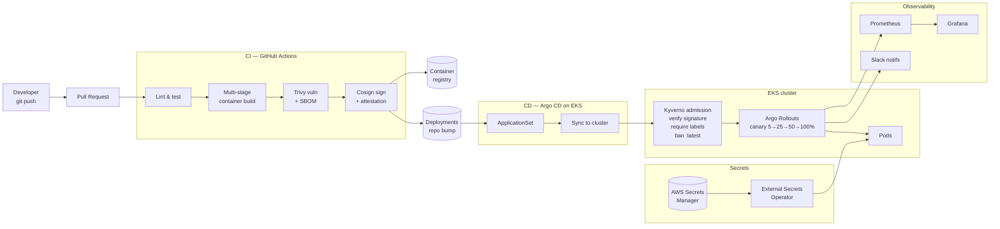

<h1 align="center">🚀 GitOps CI/CD Platform</h1>

<p align="center">
  <strong>A reference implementation of a modern, secure, GitOps-driven CI/CD platform on Kubernetes.</strong><br/>
  Terraform-provisioned EKS · Argo CD app-of-apps · Argo Rollouts canary · Kyverno policy · signed images · supply-chain secured.
</p>

<p align="center">
  
  
  
  
  
  
  
</p>

---

## 🎯 What this demonstrates

A complete, opinionated answer to: **"How does a modern team ship to production safely in 2026?"**

It's not a single tool — it's a coordinated system of tools, each picked for a specific job, wired together so that a `git push` becomes a progressively-rolled-out, signed, policy-enforced production deployment with full observability and instant rollback.

This bundle also demonstrates **event-driven CD** (Argo Events + Argo Workflows) for sub-second deploy reaction times, and **Grafana deploy annotations** so every dashboard shows a vertical line at the moment of each release — making "did the latency spike correlate with the deploy?" answerable in 5 seconds.

## 🏗️ Architecture



## 🧱 Tooling decisions

| Concern | Choice | Why |
|---|---|---|
| Infrastructure provisioning | **Terraform** | Industry standard, EKS module mature, providers chain cleanly |
| Cluster type | **Amazon EKS** | Module swappable for AKS/GKE; pattern is the same |
| Continuous delivery | **Argo CD** | UI maturity, RBAC, multi-tenancy, ApplicationSet generators |
| Event-driven CD | **Argo Events + Argo Workflows** | Sub-second deploy reaction; per-deploy audit trail as Workflow object; composable verify→bump→sync→annotate graph |
| Progressive delivery | **Argo Rollouts** | Native canary, analysis templates, traffic shifting via Ingress |
| Manifests | **Kustomize** (no Helm in app repos) | One language, no template-engine cognitive load; Helm reserved for platform components |
| CI | **GitHub Actions** | Reusable workflows, OIDC into AWS, native cosign/syft action support |
| **Code quality / SAST** | **SonarCloud** | Quality gate fails CI on coverage drop, code smells, vulns; standard enterprise checkbox |
| Image signing | **Cosign + Sigstore (keyless)** | Keyless OIDC = no key management; verifiable provenance |
| Image scanning | **Trivy** | Fast, broad coverage, SBOM in CycloneDX |
| Admission control | **Kyverno** | YAML policies (no Rego learning curve), built-in image-signature verification |
| **Secret backend** | **Dual: AWS Secrets Manager + HashiCorp Vault** | Cloud-native default; Vault for multi-cloud, dynamic creds, regulated workloads — see ADR-004 |
| Secret sync | **External Secrets Operator** | Same consumer pattern regardless of backend; no plaintext in Git |
| Dependency updates | **Renovate** | More precise than Dependabot, groups updates, supports Terraform/Helm/K8s |
| Pre-merge guardrails | **pre-commit** + **conftest** | Catches issues before CI even runs |

See [`docs/adr/`](docs/adr/) for full architecture decision records.

## 📂 Repository layout

```text
gitops-cicd-platform/
├── apps/demo-api/              # Sample application (FastAPI)
│   ├── app/                    # Source code
│   ├── tests/                  # pytest suite
│   ├── Dockerfile              # Multi-stage, non-root, distroless final
│   └── pyproject.toml
│
├── infrastructure/             # Terraform — provision the platform
│   ├── modules/eks-platform/   # EKS + Argo CD + addons bootstrap
│   └── environments/dev/       # Dev environment instance
│
├── platform/                   # Platform components (deployed by bootstrap)
│   ├── argocd/                 # AppProject + ApplicationSet
│   ├── argo-events/            # Event-driven CD: EventBus + EventSource + Sensor + Workflow
│   ├── kyverno-policies/       # Admission policies
│   └── external-secrets/       # ESO ClusterSecretStore (AWS SM + Vault) + sample ExternalSecret
│
├── deployments/                # App manifests (Argo CD source of truth)
│   └── apps/demo-api/
│       ├── base/               # Common manifests
│       └── overlays/{dev,staging,prod}/   # Per-env Kustomize patches
│
├── .github/workflows/          # CI: build, scan, sign; Terraform; policy checks
├── policies/                   # Kyverno/conftest test fixtures
├── scripts/                    # Bootstrap, smoke-test helpers
└── docs/                       # Architecture, ADRs, runbooks
```

## 🚀 Quick start

### Prerequisites
- AWS account with admin (for `terraform apply`)
- `terraform`, `kubectl`, `argocd`, `cosign` CLIs installed
- A container registry (GHCR works out of the box)

### 1. Provision the platform

```bash
cd infrastructure/environments/dev
terraform init
terraform apply        # ~15 min: VPC, EKS, Argo CD, addons
aws eks update-kubeconfig --name gitops-platform-dev --region us-east-1
```

### 2. Verify Argo CD is up

```bash
kubectl get pods -n argocd
kubectl port-forward svc/argocd-server -n argocd 8080:443
# Visit https://localhost:8080  (initial admin password printed by Terraform output)
```

### 3. Bootstrap apps

```bash
kubectl apply -f platform/argocd/projects/
kubectl apply -f platform/argocd/applicationset.yaml
```

Argo CD will now sync everything under `deployments/apps/` into the cluster, one Application per overlay.

### 4. Watch a deployment

```bash
# Cut a release: bump the image tag in deployments/apps/demo-api/overlays/dev/kustomization.yaml
# Push to main. CI builds, scans, signs, pushes the image.
# A bot PR bumps the tag in deployments/. Once merged, Argo CD syncs.
# In prod, Argo Rollouts handles the 5→25→50→100% progression.

kubectl argo rollouts get rollout demo-api -n demo-prod --watch
```

## 🔐 Supply-chain security

This repo demonstrates SLSA-aligned practices:

1. **Source integrity** — commits required to be signed (branch protection rule, not enforced here but documented)
2. **Build provenance** — GitHub Actions emits SLSA provenance attestation via `actions/attest-build-provenance`
3. **Vulnerability gate** — Trivy fails CI on `HIGH`/`CRITICAL` with a fixed version available
4. **SBOM** — Syft generates CycloneDX SBOM, attached as a Cosign attestation
5. **Image signing** — Cosign keyless (OIDC) signs every image; identity = workflow + repo
6. **Admission verification** — Kyverno blocks unsigned images at deploy time (`verifyImages` rule)

## 🚨 Progressive delivery with Argo Rollouts

The prod overlay uses an Argo Rollout, not a plain Deployment:

```yaml
# Excerpt from deployments/apps/demo-api/overlays/prod/rollout-patch.yaml
strategy:
  canary:
    steps:
      - setWeight: 5
      - pause: { duration: 2m }
      - setWeight: 25
      - pause: { duration: 5m }
      - analysis:
          templates:
            - templateName: success-rate
      - setWeight: 50
      - pause: { duration: 5m }
      - setWeight: 100
```

Combined with the AnalysisTemplate (`success-rate` queried against Prometheus), a bad release is auto-rolled-back **without paging anyone**.

## 📖 ADRs

- [ADR-001 — Argo CD over Flux](docs/adr/001-argocd-over-flux.md)
- [ADR-002 — Kustomize over Helm for app manifests](docs/adr/002-kustomize-over-helm.md)
- [ADR-003 — Kyverno over OPA Gatekeeper](docs/adr/003-kyverno-over-opa.md)
- [ADR-004 — Vault vs cloud-native secret managers](docs/adr/004-vault-vs-cloud-secrets.md)

## 📒 Runbooks

- [Rollback a bad deploy](docs/runbooks/rollback.md)
- [Failed Argo CD sync — triage](docs/runbooks/failed-sync.md)

## 🗺️ Roadmap

- [ ] Argo Workflows for CI-as-K8s alternative
- [ ] Tekton Chains as alternate signing path
- [ ] Spinnaker-style multi-cloud deploy demo
- [ ] OpenTofu variant of `infrastructure/`
- [ ] GitOps for the platform itself (Argo CD manages Argo CD)

## 📄 License

[MIT](LICENSE) © Mohammed Aboud
