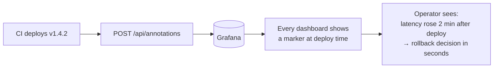

# Grafana deploy annotations

Every CI deploy fires an annotation into Grafana so dashboards show a vertical line at the moment of release. This makes "did the latency spike correlate with the deploy?" answerable in 5 seconds rather than 5 minutes of cross-referencing.

## Why this matters



Without this, debugging a latency or error-rate regression involves:

1. Asking in Slack: "when did we last deploy?"
2. Scrolling CI runs to find the timestamp
3. Eyeballing graphs against that timestamp

With it, the timestamp is **on the graph itself**, tagged with the version and git SHA.

## How it's wired

Two entry points, both already integrated:

| Path | Trigger | Mechanism |
|---|---|---|
| **CI workflow** | Every `push` to `main` that produces a new image | `annotate-grafana` job in [`ci.yml`](../.github/workflows/ci.yml) calls [`scripts/post-grafana-annotation.sh`](../scripts/post-grafana-annotation.sh) |
| **Argo Events Workflow** | Event-driven deploys (post-image-push, post-Kafka-event) | `grafana-annotate` step in the [WorkflowTemplate](../platform/argo-events/workflow-template.yaml) |

Both produce identical annotation payloads, tagged with: `deploy`, `<app>`, `<environment>`.

## Required Grafana setup

1. **Create a service account** in Grafana (`Administration → Service accounts → New`)
   - Role: **Editor** is enough — annotations require write permission
2. **Mint a token** for the service account → copy it
3. **Save the token as repo secrets** in GitHub:
   - `GRAFANA_URL` — e.g. `https://grafana.platform.example.com`
   - `GRAFANA_API_TOKEN` — the service account token

If you also want Argo Events to annotate, create matching Kubernetes secrets in `argo-events`:

```bash
kubectl create secret generic grafana-api -n argo-events \
  --from-literal=url=https://grafana.platform.example.com \
  --from-literal=token=glsa_xxxxxxxxxxxxxxxxxxxxxxxx
```

## Scoping annotations

By default, annotations are **global** — visible on every dashboard panel that has "Annotations & alerts → built-in annotations" enabled.

To scope to specific dashboards:

```bash
GRAFANA_DASHBOARD_UID=infra-overview \
  bash scripts/post-grafana-annotation.sh demo-api prod 1.4.2 abc1234
```

This restricts the annotation to the dashboard with that UID.

## Querying / cleanup

Find annotations from CI:

```bash
curl -H "Authorization: Bearer $GRAFANA_API_TOKEN" \
  "$GRAFANA_URL/api/annotations?tags=deploy&tags=demo-api&limit=20"
```

Delete an annotation by ID:

```bash
curl -X DELETE -H "Authorization: Bearer $GRAFANA_API_TOKEN" \
  "$GRAFANA_URL/api/annotations/12345"
```

## What appears in Grafana

A small vertical line per deploy, labelled with the version and environment. Hovering shows the full text and tags. Click → jump to that timestamp on the dashboard time range.

## Common gotchas

- **Annotation invisible on a panel?** Open panel settings → Annotations & alerts → ensure "Show annotations" is on for the panel
- **403 from the API?** The token's service account needs at least **Editor** role; viewer can't write
- **Annotation timestamps wrong?** Grafana annotations are millisecond Unix timestamps; the API call uses "now" by default — that's correct for deploy markers but check timezone if you backfill
