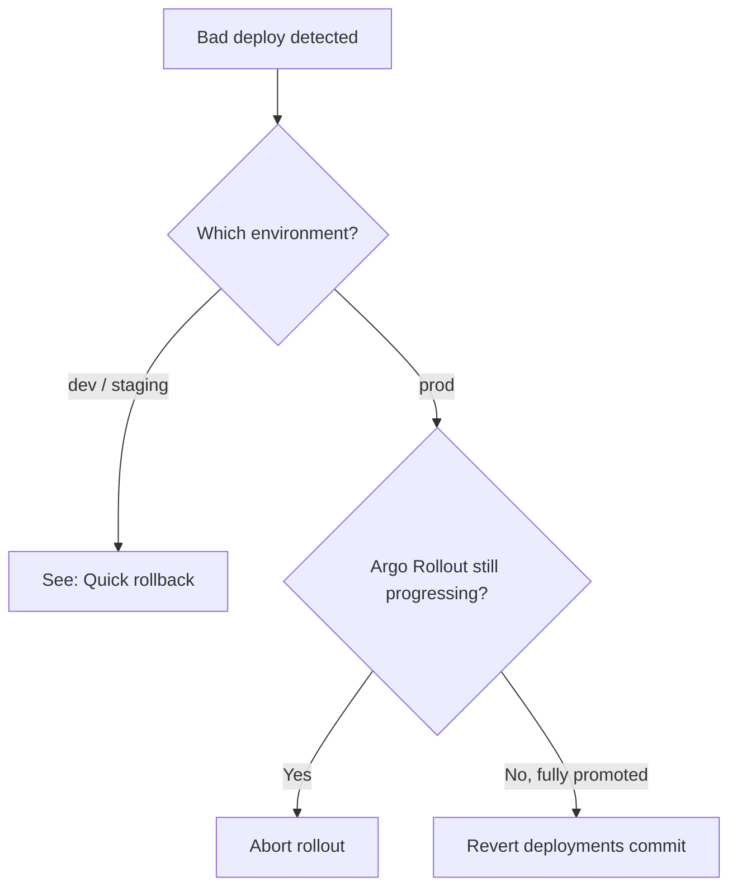

# Runbook — Rollback a bad deploy

**When to use:** A new version has been promoted to an environment and is causing user-visible issues, even though it passed CI gates.

## Decision tree



## Quick rollback (dev / staging)

Edit the affected `kustomization.yaml`:

```bash
# In deployments/apps/demo-api/overlays/dev/kustomization.yaml
# revert newTag to the previous known-good value
git revert <bad-commit-sha>
git push
```

Argo CD will pick up the change within its sync interval (default 3 minutes) and roll forward to the previous image. If you can't wait, force a sync from the UI or:

```bash
argocd app sync demo-api-dev --force
```

## Prod — abort an in-flight Argo Rollout

If the canary is mid-progression:

```bash
# Inspect
kubectl argo rollouts get rollout demo-api -n demo-prod

# Abort — immediately scales canary to 0 and keeps stable serving 100%
kubectl argo rollouts abort demo-api -n demo-prod

# Confirm
kubectl argo rollouts get rollout demo-api -n demo-prod
# Expected: phase=Degraded, no traffic on canary
```

**No code change is needed** — the Rollout is now stuck at "aborted". To unblock further deploys, either:

1. Roll forward with a fix (preferred — push fixed commit, new image, new bump PR), or
2. Restart the rollout pointing at the previous image (next section)

## Prod — fully promoted, need to revert

Argo Rollouts keeps the last 5 `revisionHistoryLimit` ReplicaSets. To roll back:

```bash
# Option A — undo from CLI
kubectl argo rollouts undo demo-api -n demo-prod
# Confirms the previous ReplicaSet is set as the canary, then progresses traffic back

# Option B — revert the git commit (preferred for GitOps purity)
git revert <bad-commit-sha>
git push
# Argo CD syncs the previous image tag; a new Rollout starts with steps reversed
```

> **GitOps rule:** the cluster always reflects what's in Git. CLI rollback is fine for emergency mitigation, but **follow it immediately with a git revert** so Argo CD doesn't re-sync the bad image.

## Post-incident

1. Open an incident record using the [RCA template](https://github.com/mohammedabood/datacenter-ops-toolkit/blob/main/templates/incident_rca_template.md)
2. Verify the AnalysisTemplate's `successCondition` and `failureLimit` — did our automation actually catch the issue, or did we have to react manually?
3. If automation failed to catch the issue, **the fix is automation**, not better operators. Add a new analysis metric.
4. Update this runbook with any new pattern observed.

## Pre-rollback sanity checks (10 seconds)

- Is this the symptom of an issue **deeper** than the new release? (e.g. dependency outage, DNS, network) — rolling back won't help
- Are dashboards and metrics still flowing? — if observability is also broken, fix that first
- Is the previous version still available in the registry? — Cosign signatures still valid?
