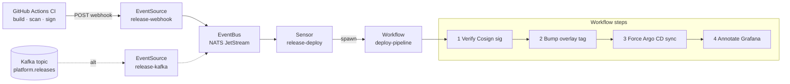

# Argo Events — event-driven CD

This directory implements **event-driven continuous deployment**: instead of Argo CD polling Git on a 3-minute cycle, an external event (CI completion, image push, Kafka message) triggers an immediate, audited deploy pipeline.

## When to use this pattern

Use Argo Events **on top of** Argo CD, not instead of it. The motivations:

- **Speed** — react to events in seconds, not minutes
- **Audit trail** — every deploy is a `Workflow` object with logs, timing, and inputs you can query
- **Compose-able actions** — verify signature → bump → sync → annotate dashboards → notify Slack, in one declarative graph
- **Decouple producers from consumers** — CI doesn't need API access to your cluster; it fires an event
- **Kafka-spine organisations** — release events join the existing event bus

If your needs are simple ("push to main → deploy"), plain Argo CD with `automated: { selfHeal: true }` is enough. Add Argo Events when you outgrow that.

## Architecture



## Components

| File | Resource | Role |
|---|---|---|
| `event-bus.yaml` | EventBus | NATS JetStream message backbone (3 replicas) |
| `eventsource-webhook.yaml` | EventSource | Listens on `:12000/release` for HMAC-signed POSTs |
| `eventsource-kafka.yaml` | EventSource | Alternative: consume from `platform.releases` topic |
| `sensor-deploy.yaml` | Sensor | Filters events; submits a Workflow with the payload |
| `workflow-template.yaml` | WorkflowTemplate | 4-step pipeline: verify → bump → sync → annotate |
| `rbac.yaml` | ServiceAccount / Role / RoleBinding | Minimal RBAC for each component |

## Wiring it up to CI

In `gitops-cicd-platform/.github/workflows/ci.yml`, the `build-and-sign` job ends by firing the webhook:

```bash
curl -fsSL -X POST "$ARGO_EVENTS_WEBHOOK_URL" \
  -H "Content-Type: application/json" \
  -H "X-Webhook-Signature: sha256=$SIGNATURE" \
  -d "$(jq -nc \
        --arg app  demo-api \
        --arg env  dev \
        --arg img  "ghcr.io/.../demo-api@sha256:$DIGEST" \
        --arg ver  "$VERSION" \
        --arg sha  "$GITHUB_SHA" \
        --arg by   "$GITHUB_ACTOR" \
        '{app:$app, environment:$env, image:$img, version:$ver, git_sha:$sha, actor:$by}')"
```

The webhook URL is the EventSource service's Ingress — see `infrastructure/modules/eks-platform/main.tf` for the Argo Events Helm release that installs the controllers and CRDs.

## What this gives you over plain Argo CD

| Concern | Plain Argo CD | + Argo Events |
|---|---|---|
| Deploy reaction time | up to 3 min (poll cycle) | seconds |
| Per-deploy audit trail | App revision history | Workflow object with full log, params, timing |
| Pre-deploy gates (e.g. Cosign verify, integration test) | Manual or PR-time only | First-class steps in the Workflow |
| Post-deploy actions (annotate dashboards, notify, smoke-test) | External tooling | First-class steps in the Workflow |
| Event source plurality (Git push, image push, Kafka, S3) | Git push only | Many — Argo Events ships 20+ source types |
| Operational complexity | Low | Medium (NATS, EventBus, Sensor logic) |

## Security notes

- The webhook EventSource requires HMAC — never deploy this without `authSecret`
- The `argo-workflow-sa` ServiceAccount can read secrets and push to Git; scope its role tightly
- Grafana API token used for annotations should be a **viewer + annotations-write** scoped service account, never an admin key

## Testing without CI

```bash
# Port-forward the EventSource service
kubectl port-forward -n argo-events svc/release-webhook-eventsource-svc 12000:12000

# Fire a test release
curl -X POST http://localhost:12000/release \
  -H "Content-Type: application/json" \
  -d '{
    "app": "demo-api",
    "environment": "dev",
    "image": "ghcr.io/mohammedabood/demo-api@sha256:0000000000000000000000000000000000000000000000000000000000000000",
    "version": "test-1",
    "git_sha": "abcdef1"
  }'

# Watch the workflow appear and progress
kubectl get wf -n argo-events -w
argo logs -n argo-events @latest -f
```
